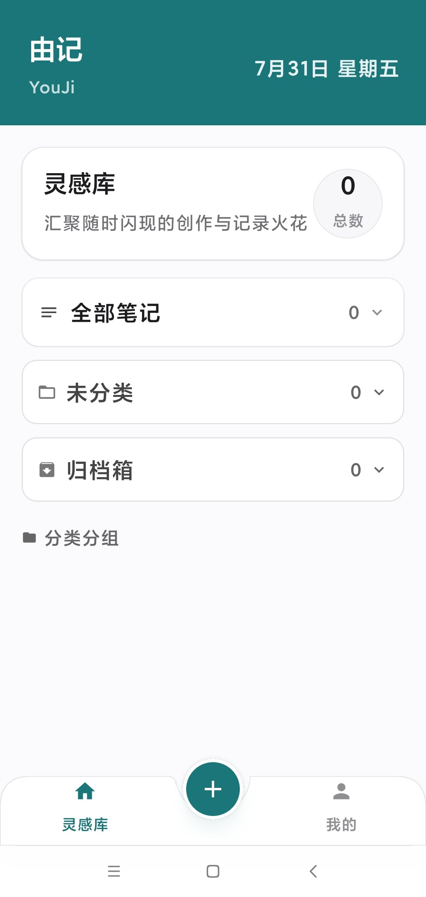
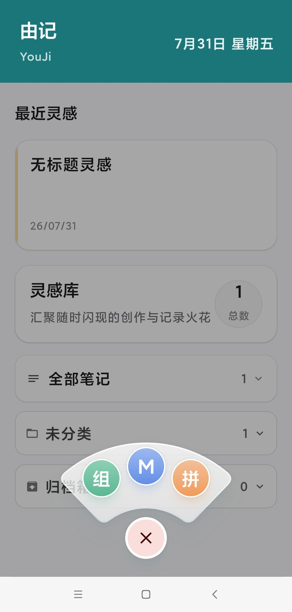
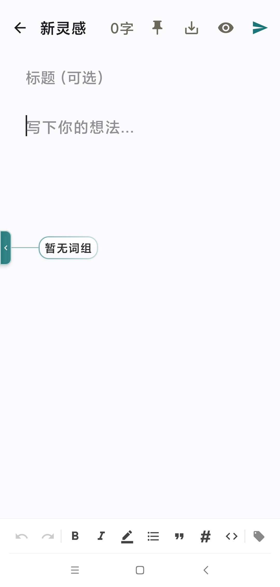
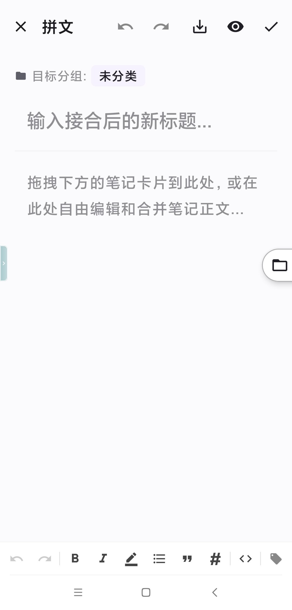

# 由记 (YouJi) 软件技术说明文档

<p align="center">
  
</p>

由记（YouJi）是一款专为创作者、写作者、研究人员设计的离线优先 Markdown 灵感笔记应用。用户可以随时捕获闪现的灵感、整理结构化文档，并使用拼文功能，通过直观的触控拖拽或一键填入将零散的笔记接合成一篇完整的文章。

---

## 核心功能说明

<p align="center">
  
  
  
  
</p>

### Markdown 编辑与实时渲染
- **自定义文本格式化工具栏（CustomTextToolbar）**：提供快捷工具栏（标题、粗体、斜体、列表、代码块、引用等），配合悬浮弹窗位置计算辅助类（`ToolbarPopupHelper` 与 `ToolbarPopupPositionProvider`），简化移动端 Markdown 符号与格式输入。
- 支持富文本渲染与纯文本编辑的无缝切换，实现沉浸式创作体验。

### 快捷词组悬浮挂件（弧形胶囊交互）
- **贴边悬浮与交互展开**：支持左右边界贴边悬浮、自由拖拽位移，展开时向屏幕内侧平滑延伸弧形胶囊词组。
- **一键填入与长按编辑**：点击胶囊词组可迅速在 Markdown 编辑区当前光标位置注入文本；长按胶囊可直接弹出编辑对话框进行实时修改。
- **智能适配与无词组引导**：当未添加任何快捷词组时展示温馨新增引导；当词组数量较多时，自动开启平滑滚轮与中心化频率排序，提升常用高频词组的选取效率。
- **个人中心统一管理**：在首页“我的”面板中提供快捷词组的快捷添加、修改、单条删除与全量清空功能。

### 灵感收集与分组管理（含动态重命名）
- **自定义分组重命名**：支持自定义分组的直接重命名（通过编辑按键或弹出对话框），重命名后自动同步更新该分组下所有关联笔记的类别名称，并无缝保持当前选择状态。
- **动态分类与拖拽重排**：支持多维度分类筛选与分组顺序自定义拖拽重排，快速查找和定位特定情境下的笔记。
- **归档与清理**：提供归档机制与彻底删除选项，保证工作区的整洁高效。

### 18周创作热力图（横向/下拉可滑动适配）
- **横向滑动滚动机制**：首页看板展示近 18 周（126 天）的创作热力图，引入横向与下拉可滚动展示，完美适配各种小屏幕设备。
- **精准月份标签对齐**：月份文案（如“四月”、“五月”、“六月”等）与热力图每周起始网格列保持精确像素级对齐。
- **日创作弹窗明细**：点击热力图任意日期方格，弹出浮窗展示该日记录的具体灵感篇数与具体日期。

### 拼文接合文档功能（特色交互）
- **磁吸抽屉面板**：通过磁吸悬浮球（FAB）收纳与展示“分类与分组”灵感库抽屉，随手展开或折叠。
- **拖拽合流与最高层级渲染**：支持将卡片从抽屉拖拽至编辑区域，拖拽浮块采用最高 zIndex（100f）渲染层级，确保在拖动过程中不被编辑区或面板遮挡；同时卡片具备轻微放大与透明度渐变等物理手势反馈。
- **快捷“填入”按钮**：在拼文卡片右下角提供直观的“填入”按键，轻点即可在当前光标位置或文档末尾快速拼接笔记内容。
- **悬停高亮与边界平滑滚动**：拖拽卡片靠近编辑区边界时，编辑区提供呼吸线高亮提示，并自动平滑向上或向下滚动长文档。
- **撤销与重做系统（Undo / Redo）**：包含完整的编辑历史状态栈，支持一键撤销与恢复拼文操作。

### 数据备份、导入与导出
- **全量 JSON 备份与恢复**：支持将全量笔记与分组结构导出为标准 JSON 文件，或从本地 JSON 备份文件一键还原数据。
- **多格式拼文导出**：拼文完成的文档支持导出为 Markdown、TXT 或系统 chooser 分享。

### 搜索历史与快捷检索
- **历史搜索记录**：自动记录用户的历史搜索词，支持快捷再次检索与历史删除。

---

## 架构设计与目录结构

本项目遵循 Android 现代开发标准与 MVVM 架构模式，结合本地 Room 数据库和 Jetpack Compose 实现完全响应式的数据流。

### 目录层级结构
```text
/app/src/main/java/com/example
│
├── MainActivity.kt                      # 应用唯一入口，定义 NavHost 与页面导航路由
├── YouJiApplication.kt                  # 自定义 Application 类，初始化全局数据库容器
│
├── data                                 # 数据层
│   ├── local                            # 本地 Room 数据库实现
│   │   ├── InspirationDatabase.kt       # RoomDatabase 声明，持有各个 DAO 实例
│   │   ├── dao                          # 数据库访问接口 (InspirationDao)
│   │   └── entity                       # 数据库实体定义 (InspirationEntity, GroupEntity, SearchHistoryEntity)
│   └── repository                       # 数据仓库实现
│       └── InspirationRepositoryImpl.kt # Room 响应式数据存取与数据持久化实现
│
├── di                                   # 依赖注入/手动注入管理
│   └── AppContainer.kt                  # 手动注入容器，管理 Repository 实例的生命周期
│
├── domain                               # 领域层数据模型与仓库接口
│   ├── model                            # 业务实体 (Inspiration, GroupInfo, QuickPhrase, YouJiExportData)
│   └── repository                       # 抽象仓库接口 (InspirationRepository)
│
└── ui                                   # 视图层（Jetpack Compose）
    ├── component                        # 辅助视图组件与导出工具
    │   ├── ExportUtils.kt               # JSON 数据全量备份/恢复与文本导出工具类
    │   ├── QuickPhraseCapsuleWidget.kt  # 快捷词组悬浮挂件与弧形/循环胶囊交互组件
    │   └── YouJiLogo.kt                 # 自定义品牌矢量 Logo 绘制组件
    ├── markdown                         # Markdown 解析器与富文本渲染引擎
    │   └── MarkdownRenderer.kt          # Markdown 标记解析与 Compose 富文本渲染
    ├── screen                           # 具体业务屏幕与交互组件
    │   ├── CustomTextToolbar.kt         # 自定义富文本格式化工具栏
    │   ├── HomeScreen.kt                # 首页看板、18周热力图与“我的”快捷词组管理
    │   ├── InspirationEditScreen.kt     # 单篇 Markdown 笔记编辑与预览页（含悬浮胶囊挂件集成）
    │   ├── InspirationListScreen.kt     # 全量笔记列表筛选页，支持分组重命名与归档
    │   ├── InspirationMergePreviewScreen.kt # 拼文界面，承载手势拖拽、快捷填入、历史回退与磁吸抽屉
    │   ├── SplashScreen.kt              # 应用启动屏
    │   ├── ToolbarPopupHelper.kt        # 悬浮工具栏 Popup 辅助类
    │   └── ToolbarPopupPositionProvider.kt # 悬浮工具栏位置计算提供者
    ├── theme                            # Material Theme 3 样式体系与配色
    └── viewmodel                        # 视图状态管理器
        └── InspirationViewModel.kt      # 全局业务状态机，统一管理 UI 状态、分组重命名与快捷词组 CRUD
```

---

## 核心组件与文件关联性

应用的日常运转依赖于以下组件的严密协同与流式通信。

### 1. 数据载体与持久化：`local` 实体 ──> `Repository` ──> `Database`
- **关联组件**：`InspirationEntity`、`GroupEntity` 与 `SearchHistoryEntity`。
- **关联关系**：
  - `InspirationDatabase` 初始化 SQLite 数据库，声明并持有各表 DAO 接口（`InspirationDao`）。
  - `InspirationRepositoryImpl` 将 Room DAO 的响应式 `Flow<List<Inspiration>>`、`Flow<List<GroupInfo>>` 进行包装，确保所有的数据修改均可向外层自动发出最新通知，提供即时 UI 刷新能力。

### 2. 全局状态汇聚与分组/词组数据联动：`Repository` / `SharedPreferences` ──> `InspirationViewModel`
- **关联组件**：`InspirationViewModel` 充当全应用唯一的业务指挥中心。
- **关联关系**：
  - ViewModel 持有 `InspirationRepository`，并在其内部定义各种状态（如 `activeNotes`、`allGroups`、`quickPhrases` 等）。
  - **分组重命名联动**：调用 `renameGroup(oldName, newName)` 时，ViewModel 在协程中批量更新 Room 中的分组实体 `GroupEntity` 和对应类别下的所有 `InspirationEntity`，并自动调整当前选中的分组状态 `_selectedGroup`，使 UI 瞬间平滑过渡。
  - **快捷词组持久化**：管理用户自定义词组的添加、更新、删除与清空，通过 `SharedPreferences` 实现 JSON 序列化持久化存储，并向外部 UI 抛出响应式 StateFlow。

### 3. 快捷词组悬浮挂件微观协作：`QuickPhraseCapsuleWidget.kt` <──> `InspirationEditScreen.kt` <──> `InspirationViewModel.kt`
- **关联组件**：`QuickPhrase` 数据模型、`QuickPhraseCapsuleWidget` 交互挂件与 `InspirationEditScreen` 编辑页。
- **关联关系**：
  - `InspirationEditScreen` 从 `InspirationViewModel` 中收集 `quickPhrases` 状态列表并传递给悬浮挂件 `QuickPhraseCapsuleWidget`。
  - 挂件支持靠侧拖拽与平滑伸展，当无词组时高亮提示引导用户至个人中心添加；当包含自定义词组时，按使用频率中心化对齐或无缝滚轮展示。
  - 点击词组直接注入编辑区当前光标，并自动增加词组的 `usageCount` 使用计数；长按可直接发起修改对话框，并同步回写至 `InspirationViewModel`。

### 4. 主界面协同与导航：`MainActivity` <──> 路由屏幕 <──> `InspirationViewModel`
- **关联组件**：`MainActivity` 内的 `NavHost`。
- **关联关系**：
  - `MainActivity` 负责建立整个应用的路由路径（启动页、首页、编辑页、拼文页、列表页），并统一将全局 ViewModel 实例分发给各个屏幕。
  - `HomeScreen.kt` 承载 18 周热力图、分组卡片快捷展开与“我的”设置面板，支持调用重命名对话框与快捷词组的快捷新增、修改与批量清空；`InspirationListScreen.kt` 提供完整的搜索历史记录交互与多标签分类过滤。

### 5. 拼文页面的微观协作关系：`InspirationMergePreviewScreen.kt` 的架构组装
- **微缩卡片高层级渲染（`DraggableNoteCard`）**：
  - 每一个在底部抽屉展现的卡片都是一个独立的 `DraggableNoteCard`。
  - 拖拽启动后，卡片将数据（`Inspiration`）以及触摸位置回调给主布局，并在全屏浮层上以 `zIndex(100f)` 的最高渲染层级绘制半透明拖拽卡片，彻底避免卡片层级被编辑区或抽屉遮挡。
- **快捷“填入”与光标拼接**：
  - 卡片不仅支持拖拽手势，还集成了“填入”快切按键，触发时通过 `insertNoteToEditor` 算法识别当前 Markdown 编辑区光标位置或结尾，自动注入分隔换行符与笔记正文。
- **历史记录栈实现撤销支持**：
  - 内部维护 `contentHistory` 历史列表与指针 `historyIndex`。
  - 每次拼文卡片拖入、一键填入或用户主动修改文本内容后，新的内容都会自动压入历史记录，支持顶部撤销（Undo）与重做（Redo）动作。

### 6. 数据导出与备份关联：`ExportUtils.kt` 与 `YouJiExportData.kt`
- **关联组件**：`YouJiExportData` 定义了全量导出 JSON 的数据结构规范。
- **关联关系**：
  - `ExportUtils.kt` 封装 Android 系统 FileProvider、Intent chooser 调起与 JSON 解析逻辑，配合 ViewModel 实现跨设备的数据备份还原。

---

## 本地开发与运行指南

### 前期准备
- 需要准备 Android Studio Ladybug (或更新版本)。
- JDK 17 及以上编译环境。

### 导入与调试步骤
1. 打开 Android Studio。
2. 点击 **Open** 并选择包含此 README 的根目录文件夹。
3. 允许 Gradle 构建工具下载依赖并自动完成项目的同步与配置。
4. 本地运行请创建包含 `GEMINI_API_KEY` 的 `.env` 配置文件（用于某些 AI 灵感辅助功能，可选）。
5. 选择连接的实体 Android 设备或运行 Android Emulator 模拟器，点击 **Run** 即可体验“由记”应用。

